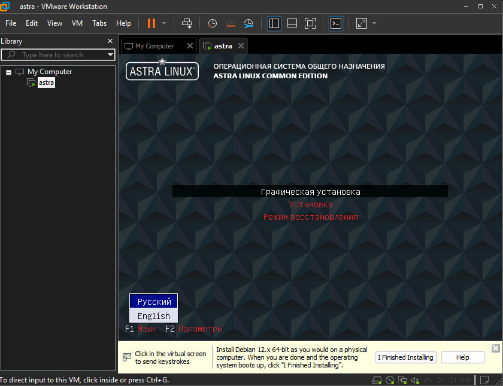

# Лабораторная работа №1: Установка и начальная настройка Astra Linux

## Цель лабораторной работы
Ознакомиться с процессом установки операционной системы Astra Linux Common Edition и выполнить начальную настройку системы для обеспечения безопасной эксплуатации.

## Задачи лабораторной работы
1. Подготовить виртуальную машину или физическую систему для установки Astra Linux, обеспечив совместимость оборудования и создав загрузочный носитель (USB/DVD).  
2. Выполнить ручную установку Astra Linux Common Edition, настроив разметку дисков с использованием LVM (Logical Volume Manager) и обеспечив безопасную загрузку.  [Ссылка на дистрибутив](https://download.astralinux.ru/astra/stable/orel/iso/alce-current.iso)
3. Настроить параметры после установки, включая создание учетных записей пользователей, установку пароля root и начальную настройку сети с помощью NetworkManager или командной строки.  
4. Установить обновления системы и проверить целостность установленной системы с помощью контрольных сумм.  
5. Задокументировать процесс установки и выбранные параметры конфигурации в отчете.

## Ожидаемый результат
Освоены основы установки и начальной настройки Astra Linux Common Edition, включая требования к оборудованию, принципы работы с Logical Volume Manager (LVM), настройку сетевых интерфейсов, меры безопасности при установке, такие как выбор уровня защищенности и установка паролей. Они поймут важность резервного копирования данных, разметки дисков и обновления системы для обеспечения стабильности и защиты информации. Кроме того, студенты научатся документировать процессы администрирования, что является ключевым навыком в профессиональной деятельности.

## Теоретическая часть
### Введение в Astra Linux Common Edition
Операционная система «Astra Linux Common Edition» (далее — ОС) представляет собой российскую разработку на базе Debian, предназначенную для общего использования в незащищенных средах, включая домашние и корпоративные системы без строгих требований к сертифицированной безопасности. В отличие от Special Edition, Community Edition не включает продвинутые механизмы защиты, такие как максимальный уровень защищенности "Смоленск", и ориентирована на стабильность и удобство. ОС поддерживает симметричную многопроцессорную обработку (SMP), автоматически определяя количество процессоров или ядер при загрузке, что оптимизирует производительность на современном оборудовании.

Установка ОС возможна с DVD-диска, USB-накопителя или по сети. Программа установки доступна в графическом и текстовом режимах, с одинаковой функциональностью, но графический режим требует не менее 1 ГБ оперативной памяти и поддерживает больше языков. Перед установкой рекомендуется создать резервную копию данных, чтобы избежать их потери, так как процесс установки может перезаписывать существующие разделы диска.

### Требования к оборудованию
Для успешной установки и эксплуатации Astra Linux Common Edition необходимо соблюдать следующие минимальные требования:
- **Процессор**: Совместимый с x86-64 архитектурой, поддержка SMP для многопроцессорных систем.
- **Оперативная память**: Не менее 1 ГБ для графического режима установки; рекомендуется 2–4 ГБ для комфортной работы.
- **Жесткий диск**: Не менее 4 ГБ свободного места для базовой конфигурации; рекомендуется 60 ГБ или более для использования LVM и моментальных снимков.
- **Видеокарта**: VGA-совместимая, поддерживаемая X.Org X11 (большинство AGP, PCI и PCIe карт).
- **Сетевой интерфейс**: Для сетевой установки — с поддержкой PXE; BIOS/UEFI с возможностью сетевой загрузки.
- **Носители**: DVD-привод или USB-накопитель емкостью не менее 5 ГБ для установки с внешних устройств.

Для обеспечения автоматической установки обновлений и возможности отката рекомендуется использовать Logical Volume Manager (LVM), таблицу разделов GPT и оставить неразмеченную область диска не менее 60 ГБ (для корневой системы, моментальных снимков и обновлений). Допускается шифрование разделов, но при обновлении они могут быть заменены на нешифрованные.

### Рекомендации по разметке дисков и использованию LVM
Logical Volume Manager (LVM) позволяет гибко управлять дисковым пространством, создавая логические тома поверх физических разделов. Это упрощает расширение, уменьшение и перемещение томов без потери данных. При установке рекомендуется:
- Выбрать автоматическую разметку с LVM для простоты: это создаст необходимые разделы, включая EFI (для UEFI), корневой том и /home.
- В LVM: логический том для корня (/) не менее 60 ГБ (ext4), отдельный том для /home (ext4, все оставшееся пространство), дополнительные тома для /tmp, /var/tmp для повышения безопасности.
- Избегать отдельного раздела подкачки (swap), используя файл подкачки внутри LVM.

Автоматическая разметка подходит для большинства случаев, особенно для начинающих, и включает LVM по умолчанию. Ручная разметка позволяет учитывать ограничения: не более четырех первичных разделов.

### Шаги установки и меры безопасности
Установка включает подготовку носителя, настройку BIOS/UEFI для загрузки, выбор режима (графический рекомендуется для удобства). В процессе:
- Настройка локализации, клавиатуры, сети (имя хоста, домен).
- Создание учетных записей: администратор с сильным паролем.
- Разметка дисков: автоматическая с LVM.
- Выбор ПО: консольные утилиты, SSH для удаленного доступа.
- Дополнительные настройки: уровень защищенности (в Common Edition доступен базовый уровень "Орёл"), мандатный контроль целостности, замкнутая программная среда, запрет ptrace, запрос пароля для sudo.
- Установка GRUB без пароля во время установки; пароль на GRUB настраивается после установки для защиты от несанкционированной загрузки.
- Завершение с перезагрузкой.

Меры безопасности: резервное копирование, выбор доступного уровня защищенности, шифрование (LUKS), ограничение прав в режиме киоска. После установки обновить систему для устранения уязвимостей и установить пароль на GRUB.

Теоретическая часть необходима для понимания выбора опций: без знаний о LVM студенты не смогут правильно разметить диск; понимание безопасности поможет выбрать правильный уровень защищенности.

## Практическое задание
Выполните установку Astra Linux Common Edition в виртуальной машине (рекомендуется VirtualBox или VMware). Следуйте поэтапным инструкциям, вводя команды в консоль где указано.

1. **Подготовка виртуальной машины**:
   - Создайте новую ВМ с типом "Linux", версией "Debian (64-bit)".
   - Выделите не менее 2 ГБ RAM, 60 ГБ HDD, 2 CPU.
   - Подключите ISO-образ Astra Linux (скачайте с официального сайта astra.ru).
   - Настройте BIOS/UEFI для загрузки с ISO.

2. **Запуск установки**:
   - Загрузитесь с ISO, выберите "Графическая установка ОС (Русский язык)".
   
   - Примите лицензионное соглашение ("Да").
   

3. **Настройка клавиатуры и сети**:
   - Выберите раскладку клавиатуры (например, Alt+Shift для переключения).
   
   - Укажите имя компьютера, например: `astra`.
   

4. **Настройка учетных записей**:
   - Создайте администратора: имя `user`, пароль (сложный, не менее 8 символов).
   - Установите пароль root с помощью команды в терминале (если нужно после установки): `sudo passwd root`.

5. **Разметка дисков с LVM**:
   - Выберите автоматическую разметку с LVM.
   
   - Подтвердите создание разделов: EFI (если UEFI), корневой том и /home в LVM.
   
   

6. **Установка базовой системы**
   - Выберите ядро для установки:
   

6. **Выбор ПО и настроек**:
   - Установите "Базовые средства" и "Средства удаленного подключения SSH".
   
   - Включите запрет на возможность трассировки ptrace.
   

7. **Установка GRUB**:
   - GRUB устанавливается без пароля; после установки настройте пароль: `sudo grub-set-password`.
   

8. **Завершение и обновление**:
   - Перезагрузитесь после установки.
   - Войдите как admin.
   - Обновите систему: `sudo apt update && sudo apt upgrade -y`.
   - Проверьте целостность: `sudo debsums -a` (установите debsums если нужно: `sudo apt install debsums`).

9. **Документирование**:
   - Запишите все шаги, команды и выборы в отчет (текстовый файл).

## Контрольные вопросы (тест)
1. Что такое LVM и почему его рекомендуется использовать при установке Astra Linux?
2. Перечислите минимальные требования к оборудованию для установки Astra Linux.
3. Какой уровень защищенности доступен в Astra Linux Community Edition?
4. Зачем устанавливать пароль на GRUB?
5. Команда для обновления системы после установки?

Ответьте на вопросы в отчете. Для прохождения лабораторной работы отчет должен быть полным и включать скриншоты ключевых шагов.

Дополнительная литература:
- https://www.aldpro.ru/professional/Windows_vs_Linux/windows_vs_linux.html
- https://www.aldpro.ru/professional/ALSE_Module_01/operating_systems.html
- https://www.aldpro.ru/professional/ALSE_Module_02/os_al_installation.html
